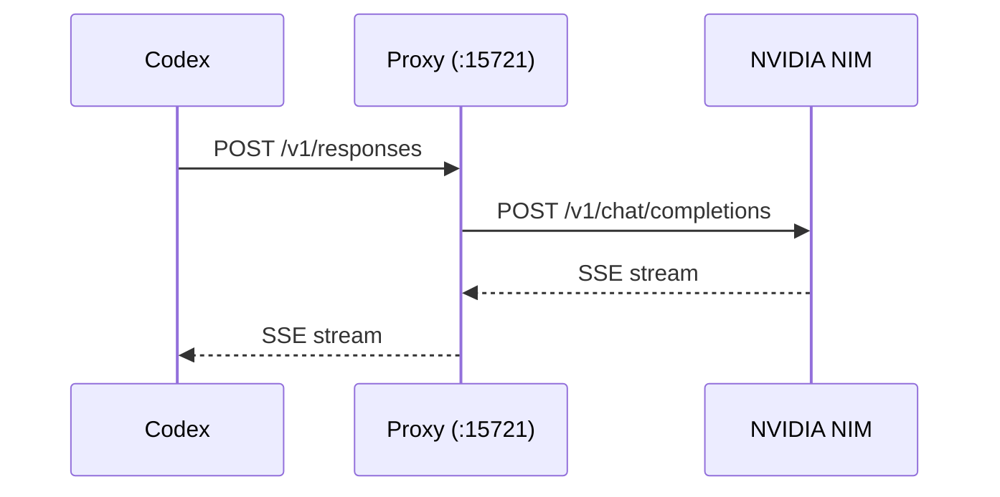
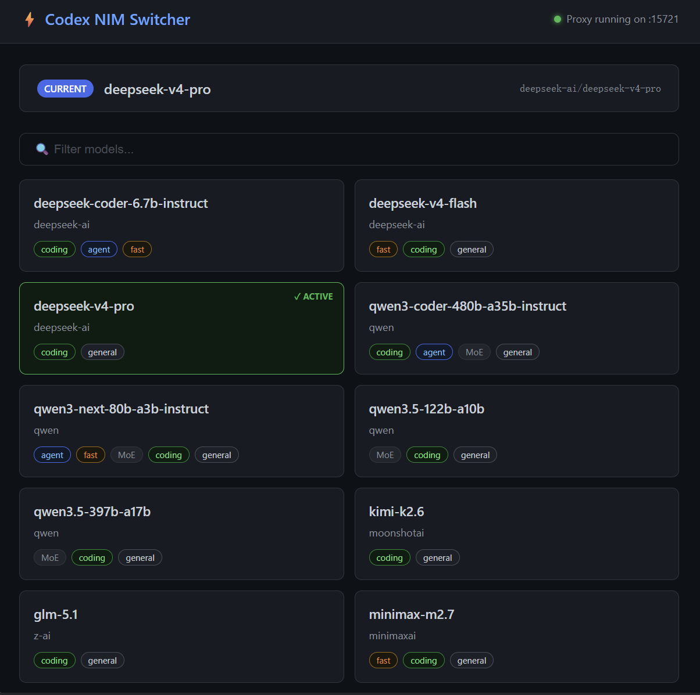

# Codex NIM Proxy

> 让 Codex 白嫖 NVIDIA 免费顶级模型：DeepSeek V4 Pro、Qwen3 Coder、Kimi K2.6 一键接入
> Use Codex with NVIDIA's free top-tier models — one-click access

Codex（CLI / 桌面版）与 NVIDIA NIM 之间的透明代理，让 Codex 免费使用 NVIDIA 托管的顶级模型。

## 项目简介

[Codex](https://github.com/openai/codex) 是 OpenAI 的 AI 编程助手（提供 CLI 和桌面版），但默认只能使用 OpenAI 的模型。[NVIDIA NIM](https://build.nvidia.com/explore/discover) 免费提供 DeepSeek V4 Pro、Qwen3 Coder 480B、Kimi K2.6 等顶级模型。

本项目是一个轻量级代理，在 Codex 和 NVIDIA NIM 之间透明转换 Responses API ↔ Chat Completions API 格式，让 Codex 无缝调用这些免费模型。

## 支持的模型

> 以下为精选推荐（更新于 2026-06），**Web UI 可一键拉取 NIM 平台全部可用模型（实时，无需手动维护）**。模型可用性可能随 NIM 平台调整，以 Web UI 实时列表为准。

| 模型 | 特点 |
|------|------|
| DeepSeek V4 Pro | 1.6T MoE, 49B active, 1M ctx, Think/Non-Think hybrid |
| DeepSeek V4 Flash | 284B MoE, 13B active, 快速编码 & agent |
| Qwen3 Coder 480B | 专用编码模型, 35B active, 256K ctx |
| Kimi K2.6 | 1T multimodal MoE, 长程编码 |
| Qwen3.5 122B | 快速通用, 10B active, ~110 tok/s |
| MiniMax M2.7 | 230B, 编码+推理+办公 |
| GLM-5.1 | 智谱旗舰, agentic & 长程推理 |
| Gemma 4 31B | Google 稠密模型, 编码 & agentic |
| Nemotron Super 120B | NVIDIA 混合 Mamba-Transformer, 1M ctx, tool calling |
| Mistral Large 3 | 675B 旗舰, 编码 & tool calling |
| Mistral Medium 3.5 | 128B, 编码 & agentic |
| Nemotron Super 49B | NVIDIA 调优, 编码 & tool calling |
| Llama 3.2 90B Vision | 最大视觉模型, 图片理解+编码 |
| Phi-4 Multimodal | 多模态推理, 视觉+音频+文本 |
| Step 3.5 Flash | 200B MoE, frontier agentic |
| Llama 3.1 405B | 最大稠密模型, 强指令跟随 |
| Seed-OSS 36B | 字节跳动, 512K ctx, 长上下文推理 & agentic |

## 架构



- 单文件 [`responses_proxy.cjs`](./responses_proxy.cjs)，零外部依赖，纯 Node.js 内置模块
- 监听 `http://127.0.0.1:15721`
- 透明转换 Codex Responses API ↔ NVIDIA Chat Completions API
- 支持流式(SSE)和非流式请求

## 功能

- **零依赖** — 单文件纯 Node.js，无需 `npm install`
- **格式透明转换** — 自动处理 Codex Responses API 与 NVIDIA Chat Completions API 之间的所有字段映射
- **流式输出** — 实时 SSE 流，思考过程和正文分离显示
- **Web 搜索** — 内置 DuckDuckGo 搜索引擎，Codex 发起搜索时代理自动执行
- **可视化模型切换** — Web UI 面板一键换模型，自动同步 Codex 配置
- **配置自动恢复** — 关闭代理自动恢复 Codex 原始配置，回到 OpenAI 官方模式
- **自动重试** — 网络波动或服务繁忙时自动重试，无需手动干预
- **模型黑名单** — 返回 404 的不可用模型自动屏蔽，刷新模型列表时自动清空重新测试
- **工具调用兼容** — 自动转换 function_call 输入格式，兼容不同模型

## Web UI

启动代理后访问 `http://127.0.0.1:15721/ui`：



*截图更新于 2026-06*

- **一键拉取最新模型** — 每次打开自动从 NVIDIA NIM 实时获取全部可用模型，始终保持最新
- **可视化切换** — 卡片式模型列表，搜索/筛选，一键切换自动同步 Codex 配置
- **离线兜底** — 拉取失败时自动回退到 [`models.json`](./models.json) 精选列表，不影响使用

## 前置条件

- [Node.js](https://nodejs.org/) >= 18
- [Codex](https://github.com/openai/codex)（CLI 或桌面版）已安装
- [NVIDIA NIM API Key](https://build.nvidia.com/explore/discover)（免费注册获取）

## 快速开始

```bash
# 1. 克隆
git clone https://github.com/ClaireMoonlit/codex-nvidia-proxy.git
cd codex-nvidia-proxy

# 2. 配置 API Key
copy .env.example .env
# 编辑 .env，填入你的 NVIDIA_API_KEY

# 3. 启动
node responses_proxy.cjs
```

Windows 用户也可以直接双击 `start_proxy.bat`。

## 配置 Codex

代理启动时会自动备份原始配置并写入 `model_provider` 格式，**无需手动修改 `config.toml`**。

关闭代理（Ctrl+C）时自动恢复原始配置，Codex 回到 OpenAI 官方模式。

模型切换通过 Web UI 一键完成，自动同步到 Codex 配置。

## 环境变量

| 变量 | 说明 | 默认值 |
|------|------|--------|
| `NVIDIA_API_KEY` | NVIDIA NIM API Key（**必需**） | 无 |
| `DEBUG` | 开启调试日志 | `false` |

## 测试

```powershell
# 非流式
$body = '{"model":"deepseek-ai/deepseek-v4-flash","messages":[{"role":"user","content":"Hello"}],"stream":false}'
Invoke-WebRequest -Uri http://127.0.0.1:15721/v1/responses -Method POST -Body $body -ContentType "application/json"

# 流式
$body = '{"model":"deepseek-ai/deepseek-v4-flash","messages":[{"role":"user","content":"Write a haiku"}],"stream":true}'
Invoke-WebRequest -Uri http://127.0.0.1:15721/v1/responses -Method POST -Body $body -ContentType "application/json"

# 带搜索
$body = '{"model":"deepseek-ai/deepseek-v4-flash","input":[{"role":"user","content":"What is the weather in Beijing today?"}],"tools":[{"type":"web_search"}],"stream":true}'
Invoke-WebRequest -Uri http://127.0.0.1:15721/v1/responses -Method POST -Body $body -ContentType "application/json"
```

## 项目结构

```
codex-nvidia-proxy/
├── responses_proxy.cjs   # 主代理 (~2150 行单文件，零依赖)
├── models.json           # 模型列表配置
├── model_state.json      # 当前选中模型（动态生成）
├── model_blacklist.json  # 不可用模型黑名单（动态生成）
├── package.json          # 项目元数据（零外部依赖）
├── start_proxy.bat       # Windows 启动脚本
├── .env.example          # 环境变量模板
└── .gitignore
```

## 许可

MIT License — 详见 [LICENSE](./LICENSE)